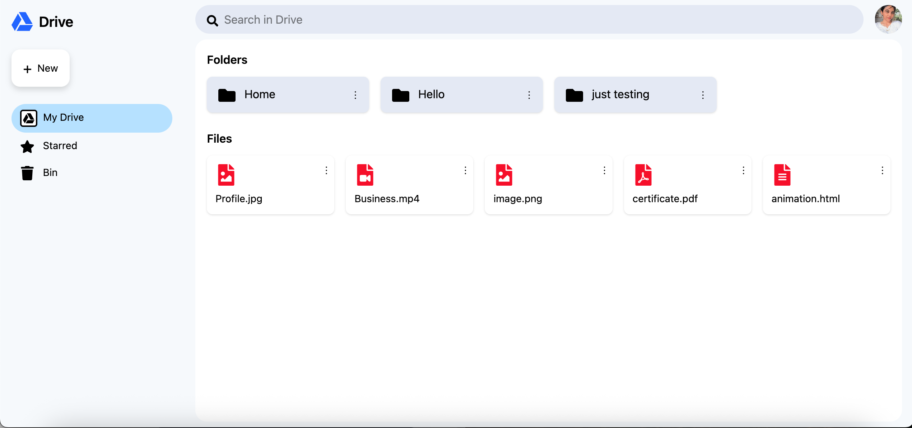

# 📁 Google Drive UI Clone (React + Tailwind)

A **Google Drive–style file manager UI** built using **React** and **Tailwind CSS**, focused on **frontend architecture, interaction patterns, and real-world UI behavior**.

## ✨ Features

- 📂 Folder & file grid layout (Drive-like)
- 🖱️ **Right-click context menu** (custom, browser menu disabled)
- 🧠 Context menu adapts based on item type (**file vs folder**)
- ❌ Click outside to close menus (proper boundary handling)
- 📱 Fully responsive (desktop & mobile)
- 🎨 Clean UI with Tailwind CSS
- 🧱 Scalable, component-driven architecture

---

## Screenshots

### Desktop

### Context Menu

### Mobile

